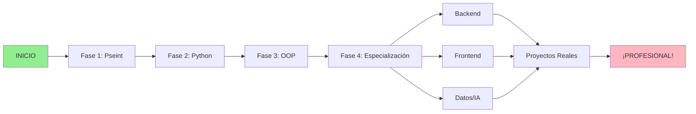

# 🚀 Aprendizaje de Programación: De Cero a Profesional

> **Una guía completa y progresiva para aprender programación desde cero, con teoría y ejemplos prácticos.**

[](https://github.com)
[](LICENSE)
[](https://www.python.org/)
[](/)

---

## 📑 Tabla de Contenidos

- [Visión General](#visión-general)
- [Estructura del Curso](#estructura-del-curso)
- [Prerequisitos](#prerequisitos)
- [Cómo Usar Este Repositorio](#cómo-usar-este-repositorio)
- [Roadmap](#roadmap)
- [Contribuir](#contribuir)
- [Licencia](#licencia)

---

## 🎯 Visión General

Este repositorio contiene una **guía educativa completa** para aprender programación desde cero. Está diseñada para:

✅ Principiantes sin experiencia en programación  
✅ Estudiantes que quieren reforzar conceptos  
✅ Personas buscando carrera en desarrollo  
✅ Autodidactas que necesitan estructura

**Características:**

- 📚 Contenido teórico bien explicado
- 💻 Ejemplos prácticos ejecutables
- 🎯 Ejercicios progresivos
- 📊 Diagramas y visualizaciones
- 🔗 Enlaces a recursos externos
- 🎓 Proyectos reales para practicar

## 🤖 ⭐ NUEVO: Usa Claude IA para Aprender

**Recomendación especial:** Usa **Claude** como tu asistente personal de aprendizaje.

📌 **Sección nueva en `recursos/` con guías completas:**

| Guía                                                              | Contenido               | Tiempo |
| ----------------------------------------------------------------- | ----------------------- | ------ |
| [README_CLAUDE.md](recursos/README_CLAUDE.md)                     | 👈 **COMIENZA AQUÍ**    | 5 min  |
| [QUICK_START_CLAUDE.md](recursos/QUICK_START_CLAUDE.md)           | Empieza en 5 minutos    | ⚡     |
| [GUIA_CLAUDE_IA.md](recursos/GUIA_CLAUDE_IA.md)                   | Guía completa           | 📖     |
| [PROMPTS_LISTOS.md](recursos/PROMPTS_LISTOS.md)                   | Plantillas copiar-pegar | 🎯     |
| [ANTIPATRONES.md](recursos/ANTIPATRONES.md)                       | Errores a evitar        | 🚫     |
| [EJEMPLOS_CONVERSACIONES.md](recursos/EJEMPLOS_CONVERSACIONES.md) | Conversaciones reales   | 💬     |

### ¿Por qué Claude?

✅ Mejor para educación que otras IAs  
✅ Explicaciones más claras  
✅ Código bien documentado  
✅ Gratis en https://claude.ai  
✅ Responsable y ético

👉 **Recomendación:** Lee [README_CLAUDE.md](recursos/README_CLAUDE.md) PRIMERO

---

## 📚 Estructura del Curso

### Fase 1: Lógica Básica (Pseint) - 2-3 semanas

**Conceptos:** Variables, operadores, condicionales, bucles, funciones  
📁 Ubicación: [`01-Pseint/`](01-Pseint/)

### Fase 2: Python Fundamentals - 4-6 semanas

**Conceptos:** Sintaxis, tipos de datos, funciones, listas, diccionarios, archivos  
📁 Ubicación: [`02-Python/`](02-Python/)

### Fase 3: Programación Orientada a Objetos - 3-4 semanas

**Conceptos:** Clases, herencia, encapsulación, polimorfismo  
📁 Ubicación: [`03-OOP/`](03-OOP/)

### Fase 4: Especialización - 2+ meses

**Rutas:** Backend | Frontend | Datos & IA  
📁 Ubicación: [`04-Especializacion/`](04-Especializacion/)

---

## 📋 Prerequisitos

No requiere experiencia previa en programación.

**Software necesario:**

| Herramienta  | Propósito            | Descargar                      |
| ------------ | -------------------- | ------------------------------ |
| VS Code      | Editor de código     | https://code.visualstudio.com  |
| Python 3.11+ | Intérprete de Python | https://www.python.org         |
| Pseint       | Pseudocódigo         | https://pseint.sourceforge.net |
| Git          | Control de versiones | https://git-scm.com            |

---

## 🚀 Cómo Usar Este Repositorio

### 🎯 COMIENZA AQUÍ

1. **Si no sabes por dónde empezar:** Lee [`INICIO_RAPIDO.md`](INICIO_RAPIDO.md) (2 min)
2. **Para evaluación del proyecto:** Lee [`EVALUACION_FINAL.md`](EVALUACION_FINAL.md)
3. **Para referencia completa:** Lee [`GUIA_COMPLETA.md`](GUIA_COMPLETA.md)
4. **Para navegación:** Lee [`INDICE.md`](INDICE.md)

### Opción 1: Clonar el Repositorio

```bash
git clone https://github.com/tu-usuario/Aprendizaje-Programacion.git
cd Aprendizaje-Programacion
```

### Opción 2: Descargar como ZIP

1. Click en `Code` → `Download ZIP`
2. Descomprime en tu computadora

### Opción 3: Leer en GitHub

Navega directamente en GitHub (no necesitas clonar)

---

## 📚 Contenido por Fase

### 🔵 Fase 1: Pseint

```
01-Pseint/
├── README.md                 # Introducción a Pseint
├── 01-variables.md           # Variables y tipos
├── 02-operadores.md          # Operadores básicos
├── 03-condicionales.md       # If/else
├── 04-bucles.md              # For y While
├── 05-funciones.md           # Funciones
├── ejercicios/
│   ├── nivel-basico.md
│   ├── nivel-intermedio.md
│   └── nivel-avanzado.md
└── ejemplos/
    ├── ejemplo-1-conversor-temp.psc
    ├── ejemplo-2-calculadora.psc
    └── ... (más ejemplos)
```

### 🟢 Fase 2: Python

```
02-Python/
├── README.md
├── 01-sintaxis-basica.md
├── 02-tipos-datos.md
├── 03-operadores.md
├── 04-condicionales.md
├── 05-bucles.md
├── 06-funciones.md
├── 07-listas.md
├── 08-diccionarios.md
├── 09-excepciones.md
├── 10-archivos.md
├── ejercicios/
│   ├── nivel-basico.md
│   ├── nivel-intermedio.md
│   └── nivel-avanzado.md
└── ejemplos/
    ├── 01-conversor-temperatura.py
    ├── 02-calculadora.py
    ├── 03-contador-palabras.py
    └── ... (más ejemplos)
```

### 🟡 Fase 3: OOP

```
03-OOP/
├── README.md
├── 01-clases-objetos.md
├── 02-herencia.md
├── 03-encapsulacion.md
├── 04-polimorfismo.md
├── ejercicios/
│   ├── biblioteca.md
│   ├── red-social.md
│   └── tienda-online.md
└── ejemplos/
    ├── biblioteca.py
    ├── red-social.py
    └── tienda-online.py
```

### 🟣 Fase 4: Especialización

```
04-Especializacion/
├── backend/
│   ├── javascript-nodejs.md
│   ├── sql-basico.md
│   └── apis-rest.md
├── frontend/
│   ├── html-css.md
│   ├── javascript-avanzado.md
│   └── react.md
└── datos/
    ├── numpy-pandas.md
    ├── machine-learning.md
    └── deep-learning.md
```

---

## 🗺️ Roadmap



---

## 💡 Ejemplo Rápido

### Ejecutar Código Python

1. **Descarga este archivo:** [`ejemplos/01-conversor-temperatura.py`](02-Python/ejemplos/01-conversor-temperatura.py)

2. **Abre una terminal:**

```bash
cd Aprendizaje-Programacion/02-Python/ejemplos
python 01-conversor-temperatura.py
```

3. **Sigue las instrucciones en pantalla**

---

## 📖 Flujo de Aprendizaje Recomendado

### Semana 1-3: Pseint

- [ ] Lee [`01-Pseint/README.md`](01-Pseint/README.md)
- [ ] Estudia variables y operadores
- [ ] Haz ejercicios nivel básico

### Semana 4-9: Python

- [ ] Lee [`02-Python/README.md`](02-Python/README.md)
- [ ] Ejecuta todos los ejemplos
- [ ] Resuelve ejercicios progresivos

### Semana 10-12: OOP

- [ ] Lee [`03-OOP/README.md`](03-OOP/README.md)
- [ ] Implementa proyectos pequeños
- [ ] Entiende arquitectura de clases

### Mes 4+: Especialización

- Elige tu ruta: Backend, Frontend o Datos
- Construye proyectos reales
- Contribuye a open source

---

## 🎯 Características Clave

### ✨ Ejemplos Ejecutables

Todos los ejemplos están **completos y funcionan**. Puedes copiar-pegar y ejecutar inmediatamente.

```python
# Ejemplo: conversor de temperaturas
celsius = float(input("Ingresa grados Celsius: "))
fahrenheit = (celsius * 9/5) + 32
print(f"{celsius}°C = {fahrenheit}°F")
```

### 📊 Diagramas Conceptuales

Visualizaciones ASCII y Mermaid para entender mejor.

### 🔗 Enlaces Recursos

Cada tema incluye enlaces a documentación oficial y tutoriales.

### ✅ Checklists de Progreso

Rastrear tu avance fácilmente.

### 🎓 Proyectos Progresivos

Desde lo simple hasta proyectos de producción.

---

## 🤝 Contribuir

¿Quieres mejorar este recurso?

1. **Fork** este repositorio
2. Crea una rama (`git checkout -b mejora/agregar-ejemplos`)
3. Haz cambios
4. **Commit** (`git commit -m 'Agrego nuevos ejemplos'`)
5. **Push** (`git push origin mejora/agregar-ejemplos`)
6. Abre un **Pull Request**

Ver [`CONTRIBUTING.md`](CONTRIBUTING.md) para más detalles.

---

## 📞 Contacto y Ayuda

- **Problemas?** Abre un [Issue](https://github.com/tu-usuario/Aprendizaje-Programacion/issues)
- **Sugerencias?** [Discusiones](https://github.com/tu-usuario/Aprendizaje-Programacion/discussions)
- **Colaborar?** Ver [`CONTRIBUTING.md`](CONTRIBUTING.md)

---

## 📄 Licencia

Este proyecto está bajo la Licencia MIT. Ver [`LICENSE`](LICENSE) para más detalles.

---

## 🌟 Agradecimientos

- Comunidad de educadores de programación
- Todos los que contribuyen mejoras
- A ti, por querer aprender a programar 🎉

---

## 📊 Estadísticas del Curso

| Métrica      | Cantidad                  |
| ------------ | ------------------------- |
| Fases        | 4                         |
| Conceptos    | 50+                       |
| Ejemplos     | 100+                      |
| Ejercicios   | 40+                       |
| Tiempo Total | 4-6 meses                 |
| Dificultad   | Principiante → Intermedio |

---

**⭐ Si te gusta este proyecto, dale una estrella en GitHub!**

---

_Última actualización: Marzo 2026_  
_Mantenedor: [Tu nombre]_
